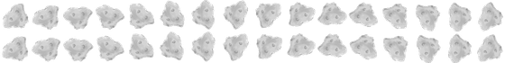

# SNAKEROIDS

[Live](https://ianhoffman.github.io/Snakeroids/)

Asteroids. Snake. Two classic games, now brought to you in one intriguing mash-up. **Snakeroids** (pronounced *Snake - er - roids* ) is a space shooter where the goal is to collect as many power sources as you can -- before the asteroids wipe you out.  
  
  
## Technologies

Snakeroids is built in pure JavaScript/HTML5 Canvas. I handrolled my own physics without the aid of prebuilt libraries like Phaser. Similarly, I didn't use a library such as Easel.js to wrap my canvas methods. One goal for this project was to get up-close and personal with the base technologies that such games are built on (i.e., with JavaScript and Canvas). 

I was inspired by traditional game-building strategies to incorporate numerous sprites in Snakeroids. From the flashing power sources to the spinning asteroids themselves, everything you'll see in Snakeroids is a Sprite (except for the shield power-up). 

# Features & Implementation

## Drawing the Space Ship

Drawing the space ship in HTML5 Canvas is actually deceptively complex. Canvas uses a `drawImage` method which takes 9(!) arguments: an image, the x and y coordinates of that iamge, the width and height of that image, the x and y coordinates on the canvas where that image is to be drawn, and then the width and height the image is to occupy on the canvas (this allows for scaling). Generically, it looks as follows:

```javascript
drawImage(
  image,
  x1, 
  y1,
  width,
  height
  x2,
  y2,
  width2,
  height2
)
```

Looking at this method, we note that it always transposes an image to the canvas by positioning its upper-left corner at x2, y2. This is a problem in a game like Snakeroids, in which you can rotate the spaceship. A rotated spaceship's upper-left corner could be positioned well *below* its lower-right corner on the screen. This must be accounted for.

To understand how to tackle this challenge, we must first understand Canvas' drawing context. This, to explain it in the simplest of terms, is the context in which canvas draws an image; for example, the context may be upside-down, or moved to the left by 90px. An image drawn in such a context will *also* be rotated upside-down and moved to the left by 90px.

Using this property of the canvas, it was simple to draw the space ship with the correct rotation: 

```javascript
ctx.save();
ctx.translate(
  this.center.x, 
  this.center.y
);
ctx.rotate(this.angle);
ctx.drawImage(
    this.img,
    (this.currCol * this.width) + this.x,
    (this.currRow * this.height) + this.y,
    this.width,
    this.height,
    this.x - (this.width / 2),
    this.y - (this.height / 2),
    this.width,
    this.height
);
ctx.restore();
```

Here, we save the current drawing context of the canvas. Then we move that context so that the spaceship (`this`) is in its upper-left corner. A context will *always* rotate around its upper-left corner. So, with the spaceship in the upper-left corner, we rotate the canver by the current angle of the spaceship. We then restore the canvas to its original state (preserved by `ctx.save()`), in which it is not translated or rotated. The ship, however, is just pixels on the screen now, and maintains the context in which *it* was drawn: it is rotated and in the appropriate position.

## Flipping between Sprites

Another way to make it appear that an image is rotating in a game such as Snakeroids is merely to use sprites. This is a traditional method almost akin to traditional animation, in which we toggle rapidly between various images to create the illusion of movement. I used sprite sheets -- images of various similar smaller images that are set up for easy toggling -- to make my asteroids appear to spin and to make the power sources flash colors. It works like this: 

```javascript
update() {
    if(this.currFrame === this.frameRate) {
        this.currCol += 1;
        this.currFrame = 0;
    } else {
        this.currFrame += 1;
    }

    if(this.currCol === this.numColumns) {
        this.currCol = 0;
        this.currRow += 1;
    }

    if(this.currRow === this.numRows ) {
        this.currRow = 0;
    }
}
```

Each sprite has a number of columns and rows. For instance, a sheet like this has two rows and sixteen columns: 



Each sprite in Snakeroids maintains a width and height (the width and height of a single frame, which, in the above example, would be the width and height of a single asteroid). The number of columns can then be computed by dividing the total width of the sprite sheet by a sprite's width, and the total number of rows can be calculated using the height. 

A sprite initializes with a `currFrame` of 0, indicating that we are beginning with the first sprite in the sprite sheet. Astute readers of the above `drawImage` method will see that we actually use the current column and current row to draw the sprite onto the canvas. You'll remember that `drawImage` takes an (X, Y) position to *begin* its drawing; this is computed by multiplying the current colum and current row by the sprite's width and height respectively. So, to draw the eighteenth sprite in the asteroid sprite sheet, we would set `currRow` to 1 and `currCol` to 1 (we start counting at 0). 

Thus, the `update` method handles toggling between sprites. Each sprite maintains a `frameRate`, but, for the time being, let's assume its `frameRate` is 0. That would mean that, every time `update` is called, we switch to the next column. If that column is equal to the number of columns, we've moved off the right of the sprite sheet, so we need to reset the column to 0 (this is because `numColumns` starts counting at 1, while `currFrame` begins at 0). The same goes for rows: when we reach the end of a column, we augment the current row (this switches the current frame to the first frame in the next row). We then check if we've exceeded the number of rows: if we have, we go back to the first sprite in the sheet. And we continue.

# Future Improvements

Snakeroids is a relatively novel concept that I'd be happy to continue improving. As it is, I can think of several cool features that would be fun to implement:

## AI

I didn't have time to make AI for this project, but it'd enhance the game if, at higher difficulty levels (more power sources collected), AI appeared and shot at you.

## Scrolling Background

Right now, the ship is contained on the screen. It'd be really cool if you could fly the ship towards the edges of the screen and it would scroll with you, generating more power sources if one ever moved off the screen. Or, even better, if *new* power sources generated offscreen, and an error pointed you towards them.

## Asteroids mode

If AI is implemented, it would be simple to toggle between Snakeroids and traditional Asteroids modes. 


