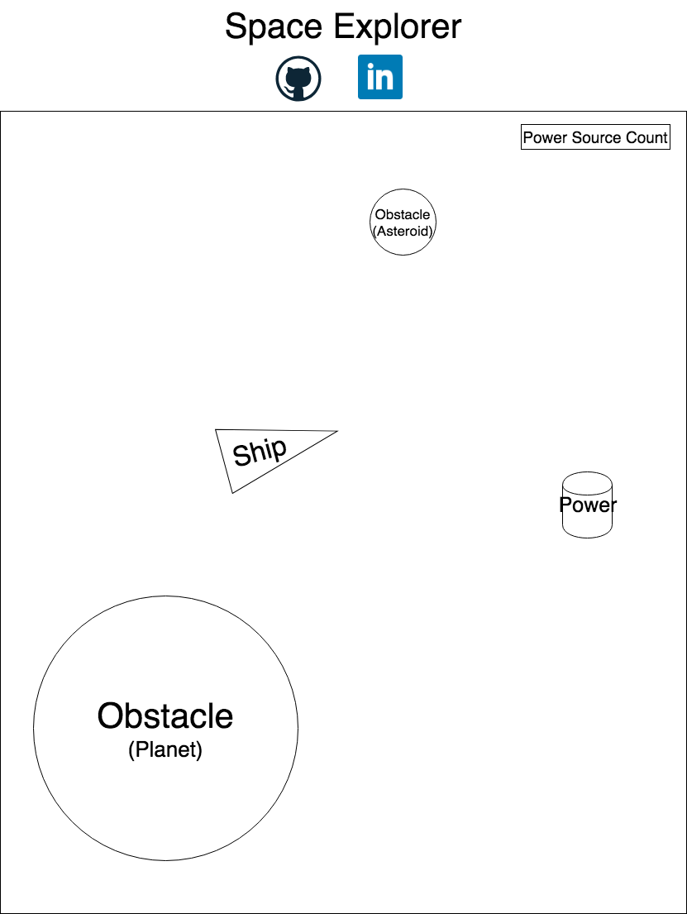

# SpaceExplorer

## Background

SpaceExplorer is loosly modeled on the classic arcade game Asteroids. However, instead of destroying Asteroids, the objective is to avoid obstacles and collect power-sources. When a player collects a level-determined number of power sources, they advance to the next level.

The player moves with WSAD or &uarr;, &darr;, &rarr;, and &larr;. AD and &rarr; and &larr; do not move the ship but rotate it. 

The player loses by colliding with an obstacle that is not a power source.

SpaceExplorer is played on an infinitely large screen; as the player moves, the viewport scrolls, generating obstacles and power-sources.

## Functionality & MVP

The player will be able to: 

* Move the ship using WSAD or &uarr;, &darr;, &rarr;, and &larr.
* Find power sources to win (the number you must find goes up every level).
* Lose the game by collision with a non-power source obstacle.
* Explore more 'space' by moving towards the edges of the viewport.

In addition, the project will include:

* An about modal that renders on start, explaining the rules of the game.
* A prodution Readme.

## Wireframes

This app will consist of a single screen with a viewport, header and links to github and my linkedIn page. The game controls and rules are simple enough that they only need to be displayed once, on start. The viewport will also render a count of the power sources that the player must collect to win.

## Architecture and Technlogies

SpaceExplorer will be implemented with the following technologies: 

* Vanilla JavaScript and `jquery` for overall structure and game logic;
* `HTML5 Canvas` for DOM manipulation and rendering;
* Webpack to bundle and serve up the various scripts.

In addition to the Webpack entry file, there will be seven scripts involved in this project: 

`game_view.js`: This script will handle the logic for advancing levels and beginning the game.

`game.js`: This script will handle logic for creating and updating the `canvas` elements and rendering them to the DOM;

`moving_object.js`: This superclass will house logic shared across all the following subclasses, such as an initial `position`, a `move` function, and a `draw` function which paints the `movingObject` onto the canvas. Collision events will also be handled here. 

`space_ship.js`: This subclass will maintain a `powerSource` count, a speed, a size, and register eventHandlers for ship movement.

`asteroid.js`: This subclass will maintain a speed and a size.

`planet.js`: This subclass will maintain a size. 

`power_source.js`: This subclass will maintain a size. 

## Implementation Timeline

**Day 1:** Set up necessary Node Modules, canvas HTML5 element and configure `webpack.config` and `package.json`. Write a basic entry file and the bare bones of `game.js` and `movingObject.js`. Goal for the day:

* Render basic movingObjects (that at the moment will not move) onto the canvas.

**Day 2:** Finish writing `movingObject.js` and flesh out much of `spaceShip.js`, `asteroid.js` and `planet.js`. Goals for the day:

* Be able to move ship around the canvas.
* Asteroids move.

**Day 3:** Implement logic that scrolls the screen if the ship gets too near one edge. Write `powerSource.js` and handle the logic collecting power sources and advancing to the next level.

* Be able to win by collect powerSources.
* Be able to explore more space by moving towards the edge of the canvas. 

**Day 4:** Style the frontend, making it polished and professional.

* SpaceShip has an image (i.e., isn't just a triangle).
* Asteroids are gray.
* Planets are many-colored (and hopefully even have some whispy vapor rising from them).  
  
  
## Bonus Features

There are many directions to go with bonus features:

* Power ups: on collision with a power-source, increase speed or allow the player to have a temporary 'shield', or even allow the player to temporarily 'shoot' and destroy asteroids.
* Fuel: implement fuel sources. If the player runs out of fuel, they lose.
* Saving: since this is not really a game you 'win', the satisfaction lies in exploring more of space. Therefore, it would be satisfying to save your gamestate.